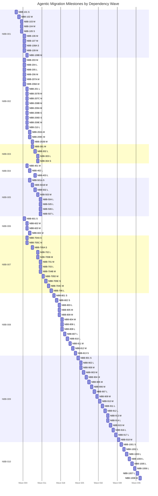

# Ticket Dependency Graph

Generated from `docs/tickets/tickets.csv` by `python docs/tickets/dag.py --write`.

## Execution Waves

| Wave | Tickets |
|---|---|
| 0 | `NBB-101` |
| 1 | `NBB-102` |
| 2 | `NBB-103`, `NBB-104`, `NBB-105` |
| 3 | `NBB-106`, `NBB-107`, `NBB-108A`, `NBB-109`, `NBB-203`, `NBB-204`, `NBB-205`, `NBB-206`, `NBB-207A`, `NBB-208A`, `NBB-601` |
| 4 | `NBB-108B`, `NBB-201`, `NBB-207B`, `NBB-207C`, `NBB-208B`, `NBB-209A`, `NBB-209B`, `NBB-209D`, `NBB-209E`, `NBB-210`, `NBB-401`, `NBB-602`, `NBB-603`, `NBB-704A`, `NBB-705C` |
| 5 | `NBB-202A`, `NBB-209C`, `NBB-402`, `NBB-501A`, `NBB-604` |
| 6 | `NBB-202B`, `NBB-301`, `NBB-501B`, `NBB-705A` |
| 7 | `NBB-302`, `NBB-403`, `NBB-502` |
| 8 | `NBB-303`, `NBB-304`, `NBB-503`, `NBB-702`, `NBB-705B` |
| 9 | `NBB-504`, `NBB-505`, `NBB-506`, `NBB-507`, `NBB-701`, `NBB-703`, `NBB-704B` |
| 10 | `NBB-705D` |
| 11 | `NBB-705E` |
| 12 | `NBB-704C` |
| 13 | `NBB-706` |
| 14 | `NBB-801` |
| 15 | `NBB-802` |
| 16 | `NBB-803`, `NBB-805`, `NBB-809` |
| 17 | `NBB-804`, `NBB-806`, `NBB-808` |
| 18 | `NBB-807` |
| 19 | `NBB-810` |
| 20 | `NBB-811` |
| 21 | `NBB-812` |
| 22 | `NBB-813` |
| 23 | `NBB-901` |
| 24 | `NBB-902`, `NBB-908` |
| 25 | `NBB-903` |
| 26 | `NBB-904` |
| 27 | `NBB-905` |
| 28 | `NBB-906` |
| 29 | `NBB-907` |
| 30 | `NBB-909` |
| 31 | `NBB-910` |
| 32 | `NBB-911` |
| 33 | `NBB-912` |
| 34 | `NBB-913`, `NBB-914` |
| 35 | `NBB-915` |
| 36 | `NBB-916` |
| 37 | `NBB-917` |
| 38 | `NBB-918` |
| 39 | `NBB-1001` |
| 40 | `NBB-1002` |
| 41 | `NBB-1003` |
| 42 | `NBB-1004` |
| 43 | `NBB-1005` |
| 44 | `NBB-1006` |
| 45 | `NBB-1007` |
| 46 | `NBB-1008` |

## Mermaid Task Dependency DAG

```mermaid
flowchart LR
  classDef p0 fill:#fee2e2,stroke:#b91c1c,color:#111
  classDef p1 fill:#e0f2fe,stroke:#0369a1,color:#111
  NBB101["NBB-101"]:::p0
  NBB102["NBB-102"]:::p0
  NBB101 --> NBB102
  NBB103["NBB-103"]:::p0
  NBB102 --> NBB103
  NBB104["NBB-104"]:::p0
  NBB102 --> NBB104
  NBB105["NBB-105"]:::p0
  NBB102 --> NBB105
  NBB106["NBB-106"]:::p0
  NBB103 --> NBB106
  NBB107["NBB-107"]:::p0
  NBB103 --> NBB107
  NBB108A["NBB-108A"]:::p0
  NBB105 --> NBB108A
  NBB108B["NBB-108B"]:::p1
  NBB108A --> NBB108B
  NBB109["NBB-109"]:::p0
  NBB103 --> NBB109
  NBB201["NBB-201"]:::p0
  NBB104 --> NBB201
  NBB107 --> NBB201
  NBB202A["NBB-202A"]:::p0
  NBB201 --> NBB202A
  NBB202B["NBB-202B"]:::p0
  NBB202A --> NBB202B
  NBB206["NBB-206"]:::p0
  NBB206 --> NBB202B
  NBB207C["NBB-207C"]:::p0
  NBB207C --> NBB202B
  NBB203["NBB-203"]:::p0
  NBB103 --> NBB203
  NBB204["NBB-204"]:::p0
  NBB104 --> NBB204
  NBB205["NBB-205"]:::p0
  NBB104 --> NBB205
  NBB104 --> NBB206
  NBB207A["NBB-207A"]:::p0
  NBB104 --> NBB207A
  NBB207B["NBB-207B"]:::p0
  NBB207A --> NBB207B
  NBB207A --> NBB207C
  NBB203 --> NBB207C
  NBB208A["NBB-208A"]:::p0
  NBB104 --> NBB208A
  NBB208B["NBB-208B"]:::p1
  NBB208A --> NBB208B
  NBB209A["NBB-209A"]:::p0
  NBB204 --> NBB209A
  NBB109 --> NBB209A
  NBB209B["NBB-209B"]:::p1
  NBB204 --> NBB209B
  NBB209C["NBB-209C"]:::p0
  NBB201 --> NBB209C
  NBB209D["NBB-209D"]:::p1
  NBB204 --> NBB209D
  NBB209E["NBB-209E"]:::p1
  NBB204 --> NBB209E
  NBB206 --> NBB209E
  NBB210["NBB-210"]:::p0
  NBB204 --> NBB210
  NBB205 --> NBB210
  NBB301["NBB-301"]:::p0
  NBB106 --> NBB301
  NBB107 --> NBB301
  NBB201 --> NBB301
  NBB202A --> NBB301
  NBB205 --> NBB301
  NBB206 --> NBB301
  NBB207A --> NBB301
  NBB207C --> NBB301
  NBB209A --> NBB301
  NBB302["NBB-302"]:::p0
  NBB301 --> NBB302
  NBB303["NBB-303"]:::p0
  NBB202B --> NBB303
  NBB207A --> NBB303
  NBB207C --> NBB303
  NBB302 --> NBB303
  NBB304["NBB-304"]:::p1
  NBB302 --> NBB304
  NBB209A --> NBB304
  NBB401["NBB-401"]:::p0
  NBB104 --> NBB401
  NBB206 --> NBB401
  NBB402["NBB-402"]:::p1
  NBB106 --> NBB402
  NBB205 --> NBB402
  NBB401 --> NBB402
  NBB403["NBB-403"]:::p1
  NBB202B --> NBB403
  NBB203 --> NBB403
  NBB207A --> NBB403
  NBB207B --> NBB403
  NBB207C --> NBB403
  NBB401 --> NBB403
  NBB501A["NBB-501A"]:::p0
  NBB104 --> NBB501A
  NBB207C --> NBB501A
  NBB501B["NBB-501B"]:::p0
  NBB501A --> NBB501B
  NBB106 --> NBB501B
  NBB204 --> NBB501B
  NBB205 --> NBB501B
  NBB206 --> NBB501B
  NBB207B --> NBB501B
  NBB207C --> NBB501B
  NBB210 --> NBB501B
  NBB502["NBB-502"]:::p0
  NBB501B --> NBB502
  NBB503["NBB-503"]:::p0
  NBB501B --> NBB503
  NBB502 --> NBB503
  NBB207A --> NBB503
  NBB207B --> NBB503
  NBB207C --> NBB503
  NBB504["NBB-504"]:::p1
  NBB503 --> NBB504
  NBB505["NBB-505"]:::p1
  NBB503 --> NBB505
  NBB506["NBB-506"]:::p1
  NBB503 --> NBB506
  NBB507["NBB-507"]:::p1
  NBB503 --> NBB507
  NBB601["NBB-601"]:::p0
  NBB105 --> NBB601
  NBB602["NBB-602"]:::p1
  NBB601 --> NBB602
  NBB108A --> NBB602
  NBB603["NBB-603"]:::p1
  NBB601 --> NBB603
  NBB108A --> NBB603
  NBB205 --> NBB603
  NBB604["NBB-604"]:::p1
  NBB602 --> NBB604
  NBB603 --> NBB604
  NBB108A --> NBB604
  NBB701["NBB-701"]:::p1
  NBB303 --> NBB701
  NBB702["NBB-702"]:::p1
  NBB402 --> NBB702
  NBB403 --> NBB702
  NBB703["NBB-703"]:::p1
  NBB502 --> NBB703
  NBB503 --> NBB703
  NBB210 --> NBB703
  NBB704A["NBB-704A"]:::p1
  NBB104 --> NBB704A
  NBB206 --> NBB704A
  NBB704B["NBB-704B"]:::p1
  NBB704A --> NBB704B
  NBB302 --> NBB704B
  NBB402 --> NBB704B
  NBB503 --> NBB704B
  NBB603 --> NBB704B
  NBB704C["NBB-704C"]:::p1
  NBB704B --> NBB704C
  NBB109 --> NBB704C
  NBB705E["NBB-705E"]:::p1
  NBB705E --> NBB704C
  NBB705A["NBB-705A"]:::p1
  NBB201 --> NBB705A
  NBB209C --> NBB705A
  NBB705B["NBB-705B"]:::p1
  NBB402 --> NBB705B
  NBB403 --> NBB705B
  NBB705C["NBB-705C"]:::p1
  NBB205 --> NBB705C
  NBB206 --> NBB705C
  NBB208A --> NBB705C
  NBB705D["NBB-705D"]:::p1
  NBB502 --> NBB705D
  NBB503 --> NBB705D
  NBB504 --> NBB705D
  NBB506 --> NBB705D
  NBB705A --> NBB705E
  NBB705B --> NBB705E
  NBB705C --> NBB705E
  NBB705D --> NBB705E
  NBB706["NBB-706"]:::p1
  NBB701 --> NBB706
  NBB702 --> NBB706
  NBB703 --> NBB706
  NBB704B --> NBB706
  NBB704C --> NBB706
  NBB705E --> NBB706
  NBB801["NBB-801"]:::p1
  NBB706 --> NBB801
  NBB802["NBB-802"]:::p1
  NBB801 --> NBB802
  NBB803["NBB-803"]:::p1
  NBB802 --> NBB803
  NBB804["NBB-804"]:::p1
  NBB803 --> NBB804
  NBB805["NBB-805"]:::p1
  NBB802 --> NBB805
  NBB806["NBB-806"]:::p1
  NBB805 --> NBB806
  NBB807["NBB-807"]:::p1
  NBB806 --> NBB807
  NBB808["NBB-808"]:::p1
  NBB803 --> NBB808
  NBB809["NBB-809"]:::p1
  NBB802 --> NBB809
  NBB810["NBB-810"]:::p1
  NBB804 --> NBB810
  NBB806 --> NBB810
  NBB807 --> NBB810
  NBB808 --> NBB810
  NBB809 --> NBB810
  NBB811["NBB-811"]:::p1
  NBB810 --> NBB811
  NBB812["NBB-812"]:::p1
  NBB811 --> NBB812
  NBB813["NBB-813"]:::p1
  NBB812 --> NBB813
  NBB901["NBB-901"]:::p1
  NBB813 --> NBB901
  NBB902["NBB-902"]:::p1
  NBB901 --> NBB902
  NBB903["NBB-903"]:::p1
  NBB902 --> NBB903
  NBB904["NBB-904"]:::p1
  NBB903 --> NBB904
  NBB905["NBB-905"]:::p1
  NBB904 --> NBB905
  NBB906["NBB-906"]:::p1
  NBB905 --> NBB906
  NBB907["NBB-907"]:::p1
  NBB906 --> NBB907
  NBB908["NBB-908"]:::p1
  NBB901 --> NBB908
  NBB909["NBB-909"]:::p1
  NBB907 --> NBB909
  NBB908 --> NBB909
  NBB910["NBB-910"]:::p1
  NBB909 --> NBB910
  NBB911["NBB-911"]:::p1
  NBB910 --> NBB911
  NBB912["NBB-912"]:::p1
  NBB911 --> NBB912
  NBB913["NBB-913"]:::p1
  NBB912 --> NBB913
  NBB914["NBB-914"]:::p1
  NBB912 --> NBB914
  NBB915["NBB-915"]:::p1
  NBB913 --> NBB915
  NBB916["NBB-916"]:::p1
  NBB915 --> NBB916
  NBB917["NBB-917"]:::p1
  NBB916 --> NBB917
  NBB918["NBB-918"]:::p1
  NBB914 --> NBB918
  NBB917 --> NBB918
  NBB1001["NBB-1001"]:::p1
  NBB918 --> NBB1001
  NBB1002["NBB-1002"]:::p1
  NBB1001 --> NBB1002
  NBB1003["NBB-1003"]:::p1
  NBB1002 --> NBB1003
  NBB1004["NBB-1004"]:::p1
  NBB1003 --> NBB1004
  NBB1005["NBB-1005"]:::p1
  NBB1004 --> NBB1005
  NBB1006["NBB-1006"]:::p1
  NBB1005 --> NBB1006
  NBB1007["NBB-1007"]:::p1
  NBB1005 --> NBB1007
  NBB1006 --> NBB1007
  NBB1008["NBB-1008"]:::p1
  NBB1007 --> NBB1008
```

## Mermaid Milestone Bar Chart

