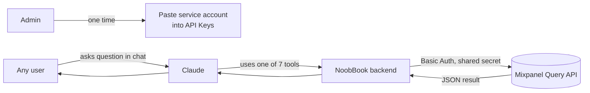
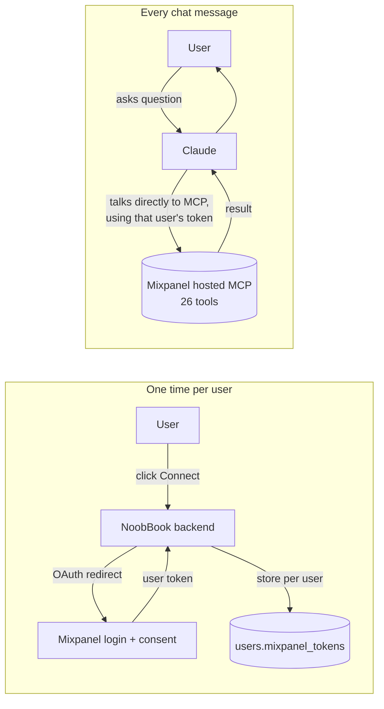

# Mixpanel Integration: What Next?

## Where we are today

Option A is built and sitting in an open PR, not yet merged or deployed. It adds Mixpanel as a project-scoped source with seven tools for querying events, funnels, retention, etc. Under the hood, it uses a single Mixpanel Service Account that an admin configures once in the settings page, shared by every user.

Mixpanel also runs a hosted MCP server (Option B) that does more and scales better. Since nothing is deployed yet, either approach is still on the table. This doc is the decision, not a retroactive justification.

## Option A: Service Account + REST (open in a PR, not yet merged)

One admin adds one secret. Everyone in NoobBook can query Mixpanel.

**What we get:**
- Simple. No per-user onboarding.
- Works for users who don't have Mixpanel accounts themselves.
- Portable. Doesn't lock us to Anthropic's API. If we swap models later, the integration keeps working.
- Ships the minute an admin pastes a secret.

**What we give up:**
- Shared 60 queries/hour across the whole app. Fine for a small team. Breaks down once 20+ people are using it.
- Mixpanel's audit log shows every query as coming from the same service account. You can't tell who did what.
- Seven handpicked tools. No dashboard creation, no session replays, no writes. If Mixpanel adds new capabilities, we have to add them by hand.
- If a user in NoobBook shouldn't see certain Mixpanel data, we can't enforce that. The service account sees everything.

## Option B: Hosted MCP + per-user OAuth

Each user clicks "Connect Mixpanel" once, logs in with their Mixpanel account (or SSO), and their personal token is stored. When they ask a question in chat, Claude talks to Mixpanel's hosted MCP server using that user's token.

**What we get:**
- 600 queries/hour per user. A 50-person team has roughly 500x more headroom than today.
- 26 tools instead of 7. Dashboards, tags, issues, session replays, and more.
- Real per-user audit trail. Mixpanel sees Daisy's query as Daisy's query.
- Permissions enforced by Mixpanel itself. If a user's Mixpanel role restricts them, the chat respects that automatically.
- Mixpanel maintains the tools. When they add features, we get them for free.

**What we give up:**
- Every user needs a Mixpanel account. If your PMs do but your support team doesn't, the support team is out.
- Each user goes through a one-time connect flow. Friction we don't have today.
- Tied to Anthropic's Messages API. If we ever want to run a non-Anthropic model in chat, we'd have to wrap the MCP server ourselves.
- Real engineering work. Roughly 2 to 3 days to build the OAuth flow, token refresh, and plumb it through the chat service. Most of the code we shipped for Option A is still reusable (source flag, processor, permissions, tab), but the query layer gets rewritten.

## How to think about it

Option A is correct when:
- Only a handful of people use it
- Everyone on the team shares the same view of Mixpanel data
- Some NoobBook users don't have Mixpanel accounts and shouldn't need them

Option B is correct when:
- Usage grows past roughly 10 active people per day (we'll hit the rate limit)
- Security or compliance cares about who queried what
- Users ask for features we didn't build (dashboards, session replay, cohorts)
- We want the integration to stay current without ongoing maintenance from us

## Side by side

| Dimension | Option A (in PR) | Option B (hosted MCP) |
|---|---|---|
| Setup burden | 1 admin, 2 minutes | 1 admin + every user, 30 seconds each |
| Rate limit | 60/hr shared | 600/hr per user |
| Tools available | 7 | 26 |
| Audit trail | Shared account | Per user |
| Works without Mixpanel accounts | Yes | No |
| LLM provider lock-in | None | Anthropic only |
| Dev effort from here | Merge the PR | Roughly 3 days on top of the PR |

## Recommendation

Merge Option A as is. It unblocks anyone who wants to try Mixpanel in chat right now, and the structural pieces (source flag, permissions, tab, processor) are the same pieces Option B would need anyway. If the team decides later to move to Option B, we keep all of that and only swap the query layer.

Revisit when any of these happen:
1. The 60/hr rate limit actually bites (users see "try again later" messages)
2. Someone asks "who ran that query?" and we can't answer
3. A user wants to do something in Mixpanel our seven tools don't cover
4. Security or legal raises the shared-service-account pattern as a concern

Budget roughly 3 days for the Option B migration when we commit to it.

## Open question for the team

Is anyone expecting heavy Mixpanel use in the next quarter? If yes, it's probably worth doing Option B proactively rather than scrambling when limits start hitting. If not, we're fine to let usage tell us.
